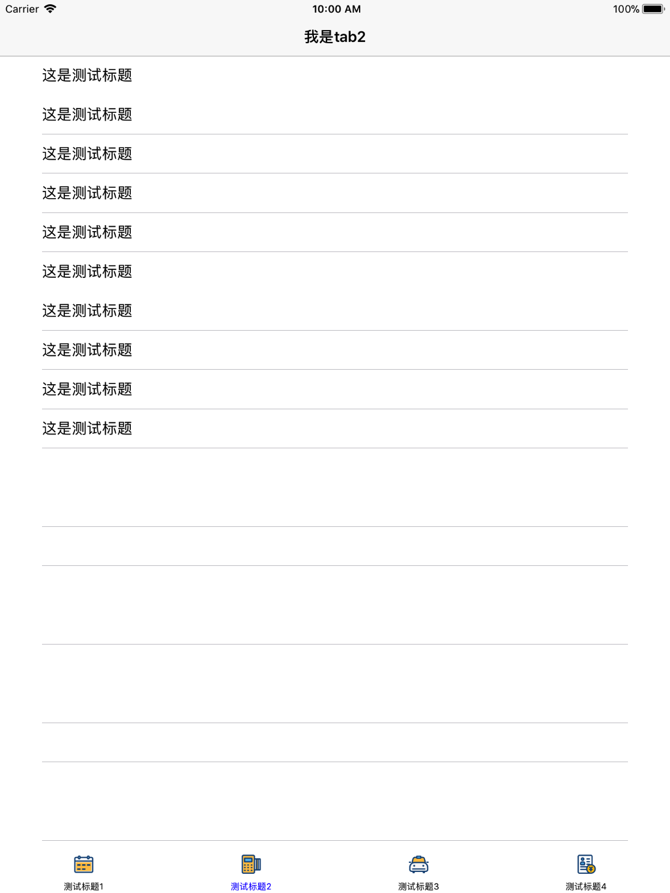
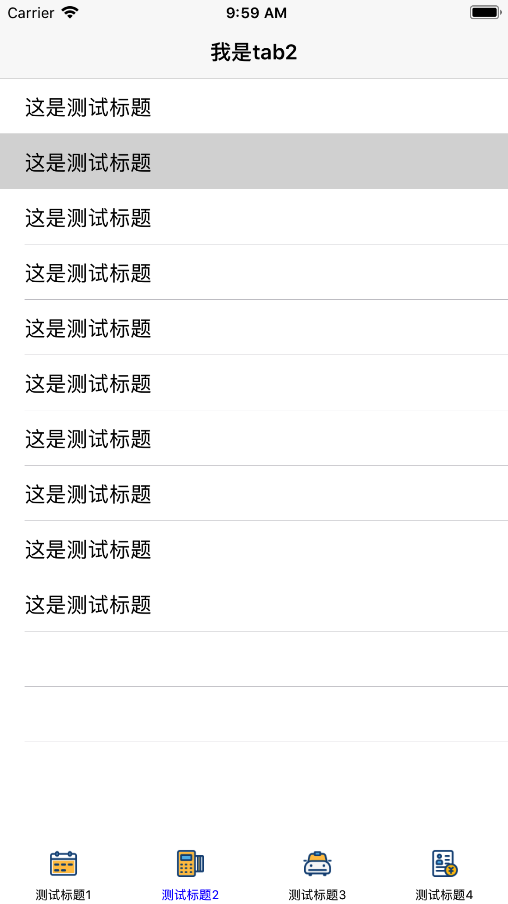

# STTabBarController

[](Screenshots/iPhone.png)

[](Screenshots/iPhone.png)

* Supports iPad and iPhone
* Can be used inside UINavigationController


## Installation

### CocoaPods

If you're using [CocoaPods](http://www.cocoapods.org), simply add `pod 'STTabBarController'` to your Podfile.

### Drag & Drop

Add the items from `STTabBarController` directory to your project. If you don't have ARC enabled, you will need to set a `-fobjc-arc` compiler flag on the `.m` source files.

## Example Usage

#### Initialize STTabBarController

The initialization is simple,just insert code below

```objective-c
STTabbarItemAttribute * attribute = [STTabbarItemAttribute defaultAttribute];
STTabbarController * tabbarController  = [STTabbarController tabbarWithItemModels:[self models] ItemAppearce:attribute];
[tabbarController setChildViewControllers:[self viewControllers]];
tabbarController.delegate = self;
tabbarController.rectEdge = UIRectEdgeNone;
self.window.rootViewController = tabbarController;


- (NSArray <STTabbarItemModel *> *)models {
    STTabbarItemModel * model1 = [[STTabbarItemModel alloc]initWithNormalImageName:@"1_normal" andSelectImageName:@"1_select" andTitle:@"测试标题1"];
    STTabbarItemModel * model2 = [[STTabbarItemModel alloc]initWithNormalImageName:@"2_normal" andSelectImageName:@"2_select" andTitle:@"测试标题2"];
    STTabbarItemModel * model3 = [[STTabbarItemModel alloc]initWithNormalImageName:@"3_normal" andSelectImageName:@"3_select" andTitle:@"测试标题3"];
    STTabbarItemModel * model4 = [[STTabbarItemModel alloc]initWithNormalImageName:@"4_normal" andSelectImageName:@"4_select" andTitle:@"测试标题4"];
    return @[model1,model2,model3,model4];
}

- (NSArray <UIViewController *>*)viewControllers {
    return @[[self navcWithVC:[ViewController1 new]],[self navcWithVC:[ViewController2 new]],[self navcWithVC:[ViewController3 new]],[self navcWithVC:[ViewController4 new]]];
}


- (UINavigationController *)navcWithVC:(UIViewController *)vc {
    return [[UINavigationController alloc]initWithRootViewController:vc];
}

```

##### For STTabbarItemAttribute
this class is design to change item behavior by user 

```objective-c
@property (strong, nonatomic) UIColor *itemTitleColor;
@property (strong, nonatomic) UIColor *itemTitleSelectColor;
@property (strong, nonatomic) UIFont  *itemTitleFont;
@property (strong, nonatomic) UIColor *itemBgColor;
@property (strong, nonatomic) UIColor *itemBgSelectColor;
@property (assign, nonatomic) CGSize   itemImgSize;
```

#### STTabbarControllerDelegate
```objective-c
- (void)STTabbarController:(STTabbarController *)tabbarController WillChangeSelectIndex:(NSInteger)selectIndex;
- (void)STTabbarController:(STTabbarController *)tabbarController DidChangeSelectIndex:(NSInteger)selectIndex;
- (BOOL)STTabbarController:(STTabbarController *)tabbarController ShouldChangeSelectIndex:(NSInteger)selectIndex;

```

####For more usage of STTabbarController, see demo in the project 

## Requirements

* ARC
* iOS 8.0 or later
* Xcode 7

## Contact

[Seventeen-17](http://weibo.com/seventeen1717171717)   

## License

STTabBarController is available under the MIT license. See the LICENSE file for more info.
